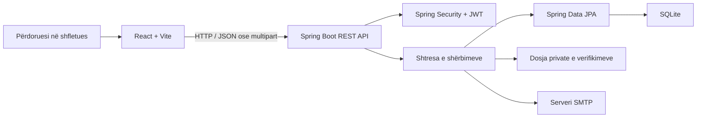

# Përmbledhje funksionale, e përmbajtjes dhe e strukturës së projektit

## HealthPath Kosovo – Healthcare Experience Platform

**Lloji i projektit:** aplikacion web full-stack, MVP universitar  
**Fusha:** transparenca e përvojave shëndetësore në Kosovë  
**Versioni i dokumentit:** 27 korrik 2026  
**Baza e dokumentimit:** implementimi aktual në kodin burimor

---

## 1. Përmbledhje ekzekutive

HealthPath Kosovo është një platformë web që u mundëson qytetarëve të lexojnë dhe të ndajnë përvoja nga rrugëtimet e tyre në sistemin shëndetësor. Përvojat fokusohen te informacione praktike si institucioni, qyteti, hapat e ndjekur, simptomat e raportuara, analizat ose testet, kostoja e përafërt, koha e pritjes dhe koha e marrjes së rezultateve.

Qëllimi kryesor është rritja e transparencës dhe krijimi i një pasqyre më të qartë për atë që një pacient mund të presë para një vizite në një spital publik ose klinikë private. Platforma nuk bën diagnostikim, nuk rekomandon trajtim dhe nuk zëvendëson profesionistët shëndetësorë.

Sistemi përfshin ndërfaqe publike, llogari përdoruesish, publikim dhe menaxhim përvojash, votim, raportim, rezultat besimi, verifikim me dokumente, panel administrimi, formular kontakti, dygjuhësi dhe funksione qasshmërie.

---

## 2. Problemi dhe qëllimi i projektit

### Problemi

Informacionet mbi kostot, pritjet, analizat dhe procedurat në institucionet shëndetësore të Kosovës janë shpesh të shpërndara ose ndahen vetëm privatisht. Si rezultat, pacientët mund të mos kenë një pritshmëri të qartë para se të kërkojnë shërbim.

### Qëllimi

Platforma synon të:

- mbledhë përvoja reale të përdoruesve në një vend të vetëm;
- lehtësojë krahasimin mes institucioneve publike dhe private;
- paraqesë kosto dhe kohë pritjeje të përafërta;
- ruajë anonimitetin e kontribuuesve kur ata e zgjedhin atë;
- krijojë sinjale komunitare të besueshmërisë;
- mundësojë raportimin dhe moderimin e përmbajtjes problematike;
- theksojë qartë se përmbajtja nuk është këshillë mjekësore.

### Kufiri i fushës

Ky version është një MVP demonstrues. Ai nuk është sistem klinik, sistem për kartela të pacientëve, platformë diagnostikimi ose burim zyrtar i çmimeve dhe afateve.

---

## 3. Grupet e përdoruesve dhe të drejtat

| Roli | Mundësitë kryesore |
|---|---|
| Vizitor | Shikon ballinën, kërkon dhe filtron përvoja, hap detajet, lexon faqet e privatësisë dhe kontaktit. Përdorimi pa llogari kufizohet në pesë veprime kuptimplota të ruajtura në `localStorage`. |
| Përdorues i regjistruar | Ka të gjitha mundësitë publike, publikon përvoja, i redakton ose i fsheh përvojat e veta, voton, raporton përmbajtje dhe përdor panelin personal. |
| Administrator | Shikon statistika, shqyrton raportimet, fsheh përvoja, shqyrton kërkesa verifikimi, hap dokumente private të verifikimit dhe miraton ose refuzon kërkesa. API-ja lejon edhe ndryshimin manual të rezultatit të besimit. |

Autorizimi realizohet në backend, jo vetëm përmes fshehjes së elementeve në ndërfaqe.

---

## 4. Funksionalitetet kryesore

### 4.1 Regjistrimi dhe autentikimi

- Krijimi i llogarisë me emër paraqitës, email dhe fjalëkalim.
- Kyçja me email dhe fjalëkalim.
- Ruajtja e fjalëkalimeve vetëm si hash BCrypt.
- Gjenerimi i JWT-së me vlefshmëri të paracaktuar 24 orë.
- Rikthimi i sesionit në frontend përmes endpoint-it `/api/auth/me`.
- Ndarja e qasjes sipas roleve `USER` dhe `ADMIN`.

### 4.2 Shfletimi dhe kërkimi i përvojave

Vizitorët mund të kërkojnë përvoja të publikuara dhe t'i filtrojnë sipas:

- tekstit të kërkimit;
- qytetit;
- kategorisë shëndetësore;
- llojit të institucionit;
- kostos minimale dhe maksimale;
- kohës së pritjes;
- nivelit të verifikimit.

Rezultatet renditen nga më e reja dhe përmbajtjet me status `HIDDEN` ose `UNDER_REVIEW` nuk shfaqen në listën publike.

### 4.3 Publikimi dhe menaxhimi i një përvoje

Përdoruesi i kyçur mund të plotësojë:

- kategorinë;
- institucionin publik ose privat;
- qytetin;
- hapat e ndërmarrë;
- deri në 10 simptoma, secila me 2–80 karaktere;
- testet ose analizat e kryera;
- koston e përafërt në euro;
- kohën e pritjes;
- kohën e rezultatit;
- një përmbledhje të rrugëtimit;
- zgjedhjen për publikim anonim.

Përvoja mund të redaktohet nga autori ose administratori. Fshirja nga autori është logjike: statusi ndryshohet në `HIDDEN`. Administratori kryen fshirje fizike përmes endpoint-it të fshirjes.

### 4.4 Dokumenti publik mbështetës

Gjatë krijimit të një përvoje mund të bashkëngjitet një PDF ose imazh. Dokumenti ruhet si BLOB në tabelën e përvojës dhe është i dukshëm publikisht në faqen e detajeve. Për imazhet, frontend-i ofron një mjet për turbullimin manual të zonave të ndjeshme para ngarkimit. Madhësia e kërkesës kufizohet nga konfigurimi i Spring në afërsisht 5 MB për skedar.

Ky dokument publik duhet dalluar nga dokumenti privat i procesit të verifikimit, i përshkruar më poshtë.

### 4.5 Votimi dhe rezultati i besimit

Përdoruesit e regjistruar mund të japin `LIKE` ose `DISLIKE` për një përvojë. Për çdo kombinim përdorues–përvojë lejohet vetëm një votë. Vota mund të ndryshohet dhe një votë e përsëritur e të njëjtit lloj hiqet.

Rezultati i besimit kufizohet në intervalin 0–100 dhe llogaritet me formulën:

```text
50 + pëlqimet e marra - mospëlqimet e marra - (5 × raportimet e marra)
```

Verifikimet e miratuara mund të shtojnë bonus. Etiketat janë:

- 80–100: Besim i Lartë;
- 50–79: Besim Mesatar;
- 0–49: I Ri / Besim i Ulët.

Rezultati paraqet besueshmëri komunitare, jo saktësi mjekësore.

### 4.6 Raportimi dhe moderimi

Një përdorues i kyçur mund të raportojë një përvojë ose përdorues për:

- ekspozim të informacionit personal;
- këshillë mjekësore;
- përmbajtje fyese;
- përmbajtje të rreme ose çorientuese;
- spam;
- arsye tjetër.

Raportimi krijohet me status `PENDING`. Administratori mund ta shënojë `REVIEWED`, `DISMISSED` ose `ACTION_TAKEN` dhe, kur është e nevojshme, ta fshehë përvojën e raportuar.

### 4.7 Verifikimi privat

Backend-i përmban një rrjedhë të veçantë verifikimi. Autori mund të dërgojë një shënim dhe dokument të redaktuar për një përvojë të vetën. Dokumenti ruhet në dosjen private `backend/data/uploads` me emër të gjeneruar dhe mund të hapet vetëm nga administratori.

Administratori mund ta miratojë kërkesën me nivel `DOCUMENT_SUPPORTED` ose `HIGH_CONFIDENCE`, ose ta refuzojë. Miratimi përditëson nivelin e përvojës dhe jep bonus besimi.

**Gjendja aktuale e integrimit:** API-ja, shërbimi, ruajtja private dhe paneli i administratorit janë të implementuara. Frontend-i ka komponentin `VerificationBox`, por ai nuk është lidhur me një faqe aktive; prandaj përdoruesi i zakonshëm nuk mund ta nisë këtë rrjedhë nga navigimi aktual.

### 4.8 Paneli personal

Paneli i përdoruesit paraqet:

- rezultatin dhe etiketën e besimit;
- pëlqimet, mospëlqimet dhe raportimet e marra;
- listën e përvojave personale;
- veprime për shikim, redaktim dhe fshehje;
- listën dhe statusin e kërkesave të verifikimit.

### 4.9 Paneli i administratorit

Paneli administrativ përmban:

- numrin total të përdoruesve;
- numrin total të përvojave;
- raportimet në pritje;
- kërkesat e verifikimit në pritje;
- përvojat e fshehura;
- mesataren e rezultatit të besimit;
- faqen e moderimit të raportimeve;
- faqen e shqyrtimit të verifikimeve dhe dokumenteve private.

### 4.10 Kontakti dhe feedback-u

Faqja “Na kontaktoni” dërgon feedback përmes backend-it dhe SMTP-së. Kredencialet e emailit qëndrojnë vetëm në server. Emri dhe emaili janë opsionalë, ndërsa mesazhi validohet. Endpoint-i publik kufizohet në pesë tentativa për adresë klienti brenda dhjetë minutave.

### 4.11 Dygjuhësia dhe qasshmëria

Ndërfaqja mbështet shqip dhe anglisht përmes `i18next`. Gjuha zbulohet dhe ruhet në shfletues.

Funksionet e qasshmërisë përfshijnë:

- lidhjen “Kalo te përmbajtja kryesore”;
- madhësi standarde, të madhe dhe shumë të madhe të tekstit;
- modalitet të ndritshëm dhe të errët;
- kontrast të lartë;
- reduktim të animacioneve;
- ruajtjen e preferencave në `localStorage`.

---

## 5. Përmbajtja e platformës

### Përmbajtja e një përvoje

Çdo përvojë mund të paraqesë kategorinë, qytetin, llojin e institucionit, përmbledhjen, simptomat e raportuara, hapat, testet, koston, pritjen, kohën e rezultateve, nivelin e verifikimit, votat dhe rezultatin e besimit të autorit. Nëse përvoja është anonime, emri dhe identifikuesi i autorit nuk dërgohen në përgjigjen publike.

### Kategoritë

Sistemi përfshin kategori si kardiologji, dermatologji, ortopedi, mjekësi familjare, oftalmologji, gjinekologji, neurologji, gastroenterologji, pulmologji, endokrinologji, urologji, pediatri, shëndet mendor, stomatologji dhe “Tjetër”.

### Qytetet

Lista fillestare përfshin Prishtinën, Prizrenin, Pejën, Gjilanin, Ferizajn, Gjakovën dhe Mitrovicën.

### Përmbajtja fillestare demonstruese

Në nisjen e parë, kur baza është bosh, sistemi krijon katër llogari demonstrimi, dhjetë përvoja fiktive, dy raportime dhe dy kërkesa verifikimi. Të dhënat janë vetëm për demonstrim dhe nuk përfaqësojnë pacientë ose pretendime reale.

### Mesazhet kryesore redaktuese

- përvojat janë orientuese dhe të raportuara nga komuniteti;
- simptomat nuk përbëjnë diagnozë;
- kostot dhe pritjet janë të përafërta;
- platforma nuk ofron këshillë mjekësore;
- përdoruesit nuk duhet të publikojnë identifikues personalë;
- rezultati i besimit nuk vlerëson saktësinë mjekësore.

---

## 6. Struktura e faqeve dhe navigimit

| Rruga | Faqja | Qasja | Përmbajtja kryesore |
|---|---|---|---|
| `/` | Ballina | Publike | Prezantimi, mënyra e funksionimit, përfitimet dhe thirrjet për veprim. |
| `/search` | Kërkimi | Publike | Kërkimi, filtrat dhe kartat e përvojave. |
| `/experiences/:id` | Detajet | Publike | Rrugëtimi i plotë, simptomat, dokumenti publik, votimi dhe raportimi. |
| `/privacy` | Privatësia | Publike | Udhëzime dhe paralajmërime për mbrojtjen e të dhënave. |
| `/contact` | Kontakti | Publike | Formulari i feedback-ut. |
| `/login` | Kyçja | Publike | Autentikimi i përdoruesit. |
| `/register` | Regjistrimi | Publike | Krijimi i llogarisë. |
| `/submit` | Ndarja e përvojës | Përdorues | Formulari i publikimit dhe dokumenti publik opsional. |
| `/experiences/:id/edit` | Redaktimi | Autor/Admin | Ndryshimi i të dhënave të përvojës. |
| `/dashboard` | Paneli personal | Përdorues | Statistikat, përvojat dhe kërkesat e verifikimit. |
| `/admin` | Paneli admin | Admin | Përmbledhja statistikore. |
| `/admin/reports` | Raportimet | Admin | Moderimi i raportimeve dhe fshehja e përvojave. |
| `/admin/verification` | Verifikimet | Admin | Shqyrtimi i kërkesave dhe dokumenteve private. |

---

## 7. Arkitektura teknike

### Teknologjitë

| Shtresa | Teknologjitë |
|---|---|
| Frontend | React 18, Vite 5, React Router, i18next, JavaScript, CSS |
| Backend | Java 17, Spring Boot 3.4.5, Spring Web, Spring Security, Spring Data JPA, Bean Validation, Spring Mail |
| Autentikimi | JWT me `jjwt`, BCrypt |
| Baza e të dhënave | SQLite, Hibernate community dialect |
| Dokumentimi i API-së | OpenAPI / Swagger UI |
| Testimi | JUnit, Spring Boot Test, Spring Security Test |

### Rrjedha e përgjithshme



Frontend-i zhvillohet në portën `5173` dhe e dërgon trafikun `/api` te backend-i në portën `5000`. Në vendosje mund të përdoret ndryshorja `VITE_API_BASE_URL`.

---

## 8. Struktura e kodit

```text
healthcare-experience-platform-kosovo/
├── frontend/
│   ├── src/
│   │   ├── api/          # klienti HTTP dhe funksionet e API-së
│   │   ├── components/   # komponentët e ripërdorshëm
│   │   ├── context/      # autentikimi dhe preferencat e qasshmërisë
│   │   ├── locales/      # përkthimet shqip dhe anglisht
│   │   ├── pages/        # faqet e lidhura me route-t
│   │   ├── styles/       # stilet globale dhe sistemi vizual
│   │   ├── utils/        # konstantet dhe kufiri i vizitorëve
│   │   ├── App.jsx       # tabela e route-ve dhe skeleti i aplikacionit
│   │   └── main.jsx      # inicializimi i React-it
│   ├── package.json
│   └── vite.config.js
├── backend/
│   ├── src/main/java/com/kosovo/healthcareexperience/
│   │   ├── config/       # siguria, CORS-i dhe të dhënat demo
│   │   ├── controller/   # endpoint-et REST
│   │   ├── dto/          # modelet e kërkesave dhe përgjigjeve
│   │   ├── entity/       # entitetet JPA
│   │   ├── enums/        # rolet, statuset dhe llojet
│   │   ├── exception/    # trajtimi i centralizuar i gabimeve
│   │   ├── repository/   # qasja në bazën e të dhënave
│   │   ├── security/     # JWT dhe ngarkimi i përdoruesit
│   │   └── service/      # logjika e biznesit
│   ├── src/main/resources/
│   │   └── application.properties
│   ├── src/test/         # testet automatike të backend-it
│   ├── data/             # baza SQLite dhe dokumentet private lokale
│   └── pom.xml
├── docs/                 # dokumentacioni i projektit
├── README.md
└── run-app.cmd           # nisja e aplikacionit në Windows
```

Backend-i përdor arkitekturë me shtresa:

- `controller` pranon kërkesat HTTP dhe zbaton rregullat e qasjes;
- `service` përmban logjikën e biznesit;
- `repository` komunikon me SQLite përmes JPA-së;
- `entity` përkufizon modelin e të dhënave;
- `dto` ndan kontratën e API-së nga entitetet;
- `security` validon JWT-në;
- `exception` standardizon përgjigjet e gabimeve.

---

## 9. Modeli i të dhënave

| Entiteti / tabela | Përgjegjësia |
|---|---|
| `users` | Llogaritë, rolet, hash-i i fjalëkalimit dhe statistikat e besimit. |
| `experiences` | Të dhënat e rrugëtimit, statusi, votat dhe dokumenti publik BLOB. |
| `experience_symptoms` | Lista e renditur e simptomave të një përvoje. |
| `votes` | Një votë për përdorues dhe përvojë. |
| `reports` | Raportimet, arsyeja, objektivi dhe statusi i moderimit. |
| `verification_requests` | Kërkesat e verifikimit dhe metadata e dokumentit privat. |

Marrëdhëniet kryesore janë:

- një përdorues ka shumë përvoja;
- një përdorues dhe një përvojë kanë shumë vota, me kufizim unik për çiftin përdorues–përvojë;
- raportimi mund t'i referohet një përvoje, një përdoruesi ose të dyve;
- një përvojë mund të ketë kërkesa verifikimi.

---

## 10. Grupet e API-së

URL-ja bazë në zhvillim është `http://localhost:5000/api`.

| Grupi | Prefiksi | Përgjegjësia |
|---|---|---|
| Auth | `/auth` | Regjistrimi, kyçja dhe profili aktual. |
| Experiences | `/experiences` | Kërkimi, detajet, krijimi, redaktimi, fshirja, dokumenti publik dhe votimi. |
| Reports | `/reports` | Krijimi dhe administrimi i raportimeve. |
| Verification | `/verification` | Kërkesat, dokumentet private dhe vendimet e verifikimit. |
| Users | `/users` | Profilet dhe rezultati i besimit. |
| Admin | `/admin` | Statistikat dhe veprimet administrative. |
| Feedback | `/feedback` | Dërgimi publik i feedback-ut me email. |

Swagger UI është në `http://localhost:5000/swagger-ui.html`.

---

## 11. Siguria dhe privatësia

Masat aktuale përfshijnë:

- JWT stateless dhe kontroll rolesh me Spring Security;
- BCrypt për fjalëkalimet;
- fshehje të identitetit në përgjigjet anonime;
- validim të kërkesave në backend;
- kontroll bazë me regex për email, telefon, numra të gjatë identifikues dhe fraza adrese;
- dokumente private verifikimi të qasshme vetëm nga administratori;
- kredenciale SMTP vetëm në backend;
- CORS të kufizuar te origjinat lokale të konfiguruara;
- përgjigje të standardizuara për gabimet.

**Kujdes i rëndësishëm:** dokumenti që bashkëngjitet drejtpërdrejt gjatë krijimit të përvojës është publik. Përdoruesi duhet të heqë të gjitha të dhënat personale para ngarkimit. Mjeti i turbullimit është ndihmues në frontend dhe nuk garanton anonimizim të plotë.

---

## 12. Ekzekutimi lokal

Në Windows, projekti mund të niset nga rrënja me:

```bat
run-app.cmd
```

Ose veçmas:

```text
Backend:  cd backend  →  mvnw.cmd spring-boot:run
Frontend: cd frontend →  npm install  →  npm run dev
```

Baza `backend/data/healthcare_experience.db` krijohet automatikisht. Të dhënat demo shtohen vetëm kur tabela e përdoruesve është bosh.

---

## 13. Kufizimet e versionit aktual

- Aplikacioni është MVP lokal dhe nuk ka konfigurim prodhimi ose containerizim.
- SQLite ka kufizime në shkrime të njëkohshme dhe konfigurimi përdor një lidhje.
- Lista e përvojave nuk ka pagination ose renditje të zgjedhshme nga përdoruesi.
- Kontrolli i të dhënave personale bazohet në regex dhe nuk është garanci anonimizimi.
- Dokumentet publike mund të përmbajnë metadata ose detaje që mjeti vizual i turbullimit nuk i heq.
- Kufiri i vizitorit ruhet në `localStorage` dhe mund të rivendoset nga përdoruesi.
- Rate limiting i feedback-ut ruhet në memorie dhe humbet pas rinisjes së backend-it.
- Nuk ka verifikim emaili, rikthim fjalëkalimi ose refresh token.
- Ndërfaqja për nisjen e verifikimit privat ekziston si komponent, por nuk është lidhur me route-t aktuale.
- Endpoint-i për ndryshimin manual të besimit ekziston, por paneli aktual nuk ka kontroll vizual për të.
- Sekreti i JWT-së në konfigurim është vetëm për zhvillim lokal dhe duhet zëvendësuar në prodhim.
- Nuk ka teste automatike të frontend-it; testet aktuale mbulojnë vetëm pjesë të backend-it.

---

## 14. Zhvillimet e rekomanduara

1. Të vendoset qartë nëse dokumentet e përvojës duhet të jenë publike apo vetëm private dhe të harmonizohet i gjithë fluksi.
2. Të lidhet `VerificationBox` me faqen e detajeve ose panelin personal.
3. Të shtohen skanim antivirus, heqje metadata, validim MIME dhe politikë fshirjeje për dokumentet.
4. Të shtohen pagination, renditje dhe kërkim më i avancuar.
5. Të zgjerohet zbulimi i të dhënave personale dhe të krijohet radhë moderimi njerëzor.
6. Të shtohen verifikimi i emailit, rikthimi i fjalëkalimit, refresh tokens dhe audit logs.
7. Të shtohen teste të frontend-it dhe teste integrimi për sigurinë dhe dokumentet.
8. Të përdoret PostgreSQL, menaxhim sekretësh dhe ruajtje e enkriptuar për vendosje reale.
9. Të përgatiten politikat e ruajtjes së të dhënave, fshirjes dhe përputhshmërisë me kërkesat ligjore.

---

## 15. Përfundim

HealthPath Kosovo demonstron një platformë të plotë për mbledhjen dhe shfletimin e përvojave shëndetësore, me fokus te anonimiteti, transparenca dhe besueshmëria komunitare. Projekti ka ndarje të qartë frontend–backend, API REST, model të strukturuar të të dhënave, role përdoruesish dhe mjete moderimi. Për përdorim real, prioritetet kryesore janë forcimi i privatësisë së dokumenteve, përfundimi i rrjedhës së verifikimit në UI, zgjerimi i testimit dhe kalimi në infrastrukturë prodhimi.
